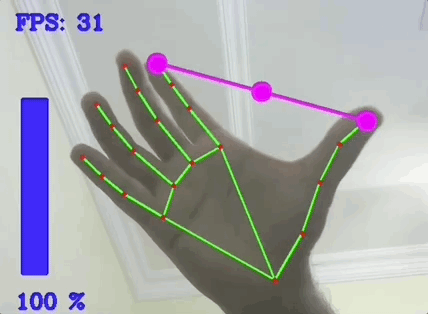
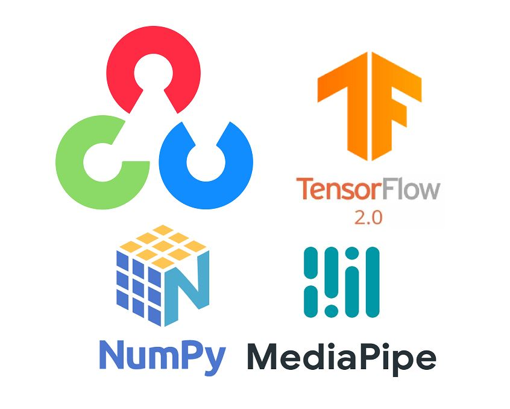

# Gesture-Volume-Control-using_OpenCV

## Table of Content ##
- [Overview](#overview) 
- [Motivation](#motivation) 
- [Installation](#installation) 
- [About the MediaPipe](#about-the-mediapipe) 
- [Libraries Used](#libraries-used)
- [PyCaw](#pycaw) 
- [Code Snippets](#code-snippets)
- [Deployment](#deployment)  
- [Team](#team) 

## Overview 
OpenCV is a library used for computer vision applications. With help of OpenCV, we can build an enormous number of applications that work better in real-time. Mainly it is used for image and video processing. This project all about Gesture Volume Control using OpenCV. We first look into hand tracking and then we will use the hand landmarks to find gesture of our hand to change the volume. This project is module based which means we will be using a previously created hand module which makes the hand tracking very easy. 



## Motivation 
The motivation for developing computer vision projects is the human vision system which is richest sense that we have. I heard about omplex cameras are being integrated into many devices (Smartphones how have cameras producing depth images as well as color images, wide-angle cameras are being integrated into cars so that a birds-eye image can be created, cameras are appearing in smart glasses), and this, in turn, is pushing the development of progressively more complex vision systems. SO that is big mmotivation to me for learning opencv and basics of computer vision projects.

## Installation 
The Code is written in Python 3.7. If you don't have Python installed just [clik here](https://www.python.org/downloads/) and install python on your system. 
If you are using a lower version of Python you can upgrade using the pip package, ensuring you have the latest version of pip. To install the required packages and libraries, such as opencv, numpy and mediapipe that's it

``` python

Install the required modules

–> pip install opencv-python
-> pip install numpy
–> pip install mediapipe
-> pip install tensorflow
-> pip install pycaw
```

## About the MediaPipe

MediaPipe is a framework mainly used for building audio, video, or any time series data. With the help of the MediaPipe framework, we can build very impressive pipelines for different media processing functions.

Some of the major applications of MediaPipe.

* Multi-hand Tracking
* Face Detection
* Object Detection and Tracking
* Objectron: 3D Object Detection and Tracking
* AutoFlip: Automatic video cropping pipeline etc.


## Libraries Used 

[]


## PyCaw

### What is pycaw?
Python Core Audio Windows Library. Visit Snyk Advisor to see a full health score report for pycaw, including popularity, security, maintenance & community analysis.

#### Is pycaw popular?
The python package pycaw receives a total of 2,063 weekly downloads. As such, pycaw popularity was classified as small. Visit the popularity section on Snyk Advisor to see the full health analysis.

#### Is pycaw well maintained?
We found indications that pycaw is an Inactive project. See the full package health analysis to learn more about the package maintenance status.

#### Is pycaw safe to use?
The python package pycaw was scanned for known vulnerabilities and missing license, and no issues were found. Thus the package was deemed as safe to use. See the full health analysis revi

## Code Snippets

``` python

# Install the Libraries

import cv2
import time
import numpy as np
import Hand_Tracking_Module as htm
import math
from ctypes import cast, POINTER
from comtypes import CLSCTX_ALL
from pycaw.pycaw import AudioUtilities, IAudioEndpointVolume

```

``` python
Note: In this project we should use our previous project model is Hand Tracking then only we can able to do this project very easily.

-> import Hand_Tracking_Module as htm
```

``` python
# Frame Desing Scale
wCam = 640
hCam = 480
pTime = 0

cap = cv2.VideoCapture(0)

cap.set(3, wCam)
cap.set(4, hCam)

```

``` python
# Function Start
# Call the Hand Tracker Model using instance

detector = htm.handDetector(detectionCon=0.7)

devices = AudioUtilities.GetSpeakers()
interface = devices.Activate(IAudioEndpointVolume._iid_, CLSCTX_ALL, None)
volume = cast(interface, POINTER(IAudioEndpointVolume))
# volume.GetMute()
# volume.GetMasterVolumeLevel()
volRange = volume.GetVolumeRange()
minVol = volRange[0]
maxVol = volRange[1]
vol = 0
volBar = 400
volPer = 0

```

``` python 
# Hand Tracking model and Point the 4th and 8 th coordinates
while True:
    success, img = cap.read()
    img = detector.findHands(img)
    lmlist = detector.findPosition(img, draw=False)
    if len(lmlist) != 0:
        #print(lmlist[4], lmlist[8])

        x1, y1 = lmlist[4][1], lmlist[4][2]
        x2, y2 = lmlist[8][1], lmlist[8][2]
        cx, cy = (x1+x2) // 2, (y1+y2) // 2

        cv2.circle(img, (x1, y1), 15, (255, 0, 255), cv2.FILLED)
        cv2.circle(img, (x2, y2), 15, (255, 0, 255), cv2.FILLED)
        cv2.line(img, (x1, y1),(x2,y2),(255, 0, 255), 3)
        cv2.circle(img, (cx, cy), 15, (255, 0, 255), cv2.FILLED)

        length = math.hypot(x2-x1, y2-y1)
        # print(length)


```
``` python
        vol = np.interp(length, [15, 210], [minVol, maxVol])
        volBar = np.interp(length, [15, 210], [400, 150])
        volPer = np.interp(length, [15, 210], [0, 100])
        print(int(length), vol)
        volume.SetMasterVolumeLevel(vol, None)

        if length < 110:
            cv2.circle(img, (cx, cy), 15, (0, 255, 0), cv2.FILLED)

    cv2.rectangle(img, (50, 150), (85, 400), (0, 255, 0), 3)
    cv2.rectangle(img, (50, int(volBar)), (85, 400), (0, 255, 0), cv2.FILLED)
    cv2.putText(img, f'{int(volPer)} %', (40, 450), cv2.FONT_HERSHEY_SIMPLEX, 1, (244, 208, 63), 2)

```

``` python
    # FPS Calculation
    cTime = time.time()
    fps = 1 / (cTime - pTime)
    pTime = cTime
    
    cv2.putText(img, f'FPS:{int(fps)}',(40, 60), cv2.FONT_HERSHEY_SIMPLEX, 1, (220,20,60), 2)
    
    cv2.imshow("Img", img)
    cv2.waitKey(1)

```

## Deployment 

There is no Deployment now, maybe in the future this project definitely gonna deploy.

## Team


